<div align="center">

# 🔩 Contador de Parafusos

**Microsserviço de visão computacional clássica que conta parafusos em uma foto.**


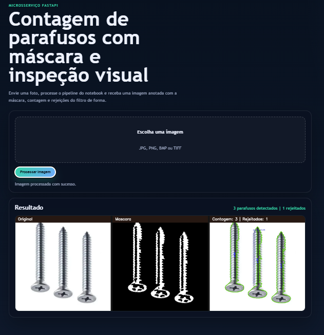

</div>

## Sobre

O serviço recebe uma imagem, executa o pré-processamento, aplica morfologia e watershed, filtra os contornos por métricas de forma e devolve uma imagem anotada com:

- máscara binária
- contornos válidos destacados
- contagem total de parafusos
- marcação dos itens rejeitados

Sem rede neural e sem treino: todo o pipeline usa apenas OpenCV e NumPy, seguindo o que foi prototipado no notebook [contar_parafuso_batch.ipynb](Notebooks/contar_parafuso_batch.ipynb).

<div align="center">
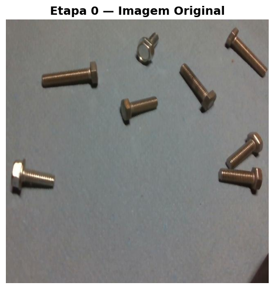
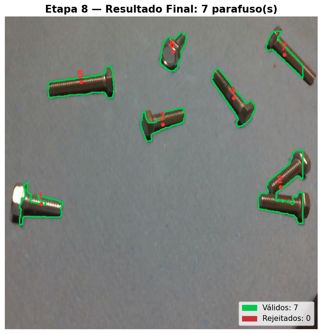
</div>

## Pipeline de segmentação

### 1. Escala de cinza e blur gaussiano

A imagem é convertida para tons de cinza e suavizada para remover ruído de alta frequência antes da binarização.

<div align="center">
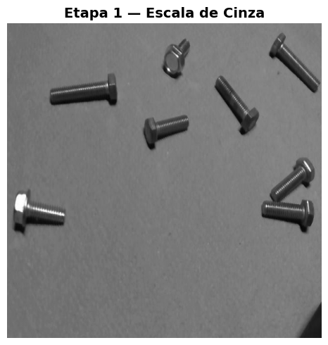
<br>
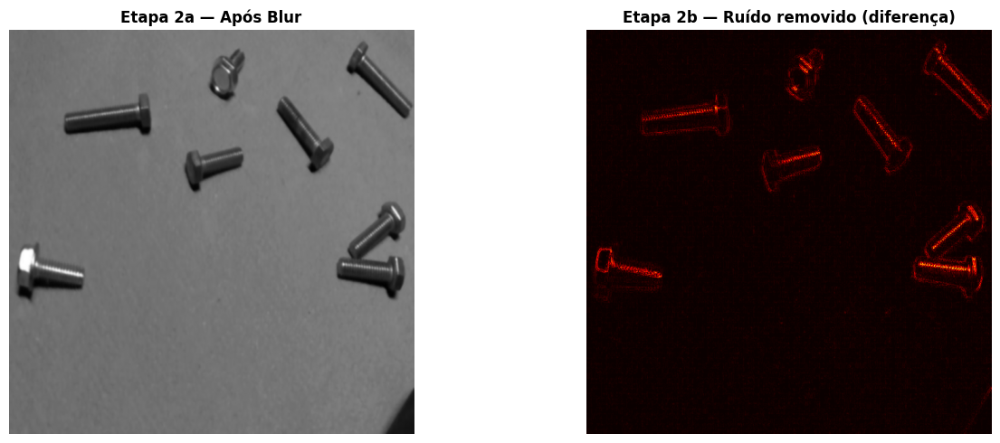
</div>

### 2. Binarização adaptativa

O histograma não tem um vale claro entre fundo e objeto, então um limiar global não funciona. O limiar adaptativo calcula o corte por vizinhança.

<div align="center">
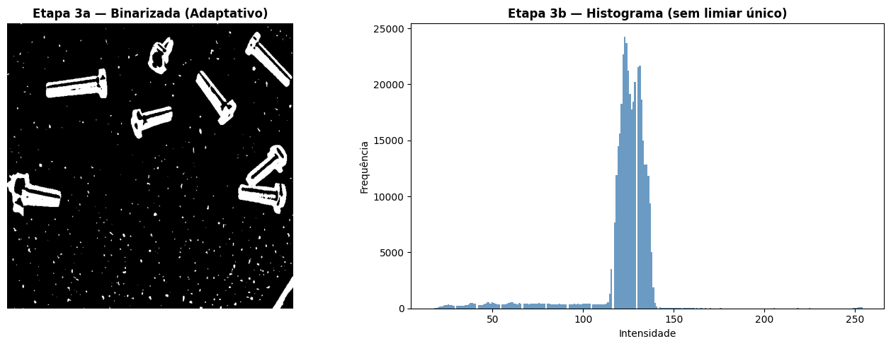
</div>

### 3. Morfologia (close + open)

O fechamento preenche os reflexos metálicos dentro dos parafusos e a abertura remove os pontos de ruído do fundo.

<div align="center">
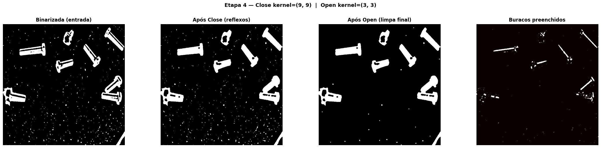
</div>

### 4. Watershed

A transformada de distância gera os marcadores que separam parafusos encostados em regiões distintas.

<div align="center">
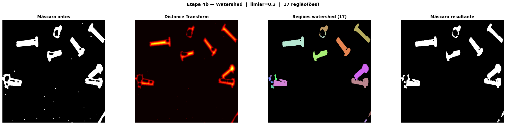
</div>

### 5. Contornos candidatos

<div align="center">
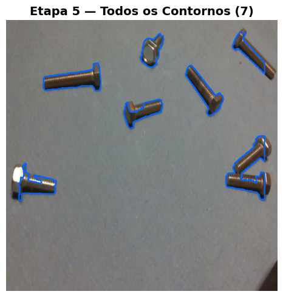
</div>

### 6. Filtros de área e forma

Cada contorno precisa passar pelos limites de área e pelas métricas de solidez, aspecto e extent. O que não passa é marcado como rejeitado.

<div align="center">
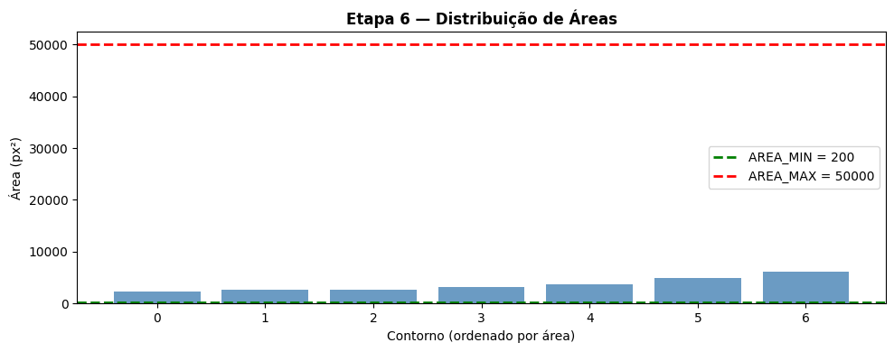
<br>
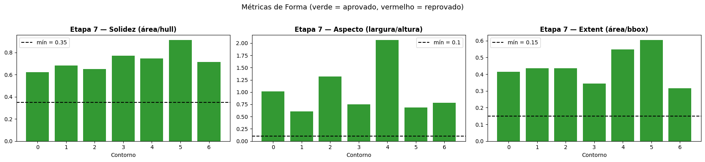
</div>

### 7. Resultado final

<div align="center">

</div>

## Executar localmente

```bash
python -m venv .venv
.venv\Scripts\activate        # Linux/macOS: source .venv/bin/activate
pip install -r requirements.txt
uvicorn app:app --reload
```

Abra `http://127.0.0.1:8000`.

## Docker

```bash
docker build -t contador-parafusos .
docker run -p 8000:8000 contador-parafusos
```

## Endpoint

### `POST /api/process`

Recebe `multipart/form-data` com o campo `file`.

| Resposta | Descrição |
| --- | --- |
| corpo `image/png` | imagem processada (original, máscara e contagem) |
| header `X-Screw-Count` | quantidade de parafusos detectados |
| header `X-Rejected-Count` | quantidade de contornos rejeitados |

```bash
curl -F "file=@img1.jpg" http://127.0.0.1:8000/api/process -o resultado.png -D -
```

## Ajustes do pipeline

Os parâmetros ficam no topo de [processing.py](processing.py):

| Parâmetro | Valor | Função |
| --- | --- | --- |
| `BLUR_KERNEL` | `(5, 5)` | kernel do blur gaussiano |
| `CLOSE_KERNEL` / `CLOSE_ITER` | `(9, 9)` / `1` | fechamento, preenche reflexos |
| `MORPH_KERNEL` / `MORPH_ITER` | `(3, 3)` / `2` | abertura, remove ruído |
| `USAR_WATERSHED` | `True` | separa parafusos encostados |
| `WATERSHED_DIST_LIMIAR` | `0.3` | limiar da transformada de distância |
| `AREA_MIN` / `AREA_MAX` | `200` / `50000` | faixa de área aceita (px²) |
| `SOLIDEZ_MIN` | `0.35` | área / área do fecho convexo |
| `ASPECTO_MIN` / `ASPECTO_MAX` | `0.10` / `10.0` | largura / altura |
| `EXTENT_MIN` | `0.15` | área / área do bounding box |
| `MARGEM` | `30` | borda da máscara zerada (px), descarta objetos cortados |

## Estrutura

```
├── app.py                  # API FastAPI e interface web
├── processing.py           # pipeline de visão computacional
├── templates/index.html    # página de upload
├── static/styles.css       # estilo da interface
├── Notebooks/              # notebooks de experimentação
├── imagens/                # figuras usadas neste README
├── img1.jpg … img5.jpg     # imagens de exemplo para teste
├── relatorio_tecnico.md    # relatório técnico do desafio
├── requirements.txt
└── Dockerfile
```

Mais detalhes sobre as decisões do pipeline estão no [relatório técnico](relatorio_tecnico.md).
